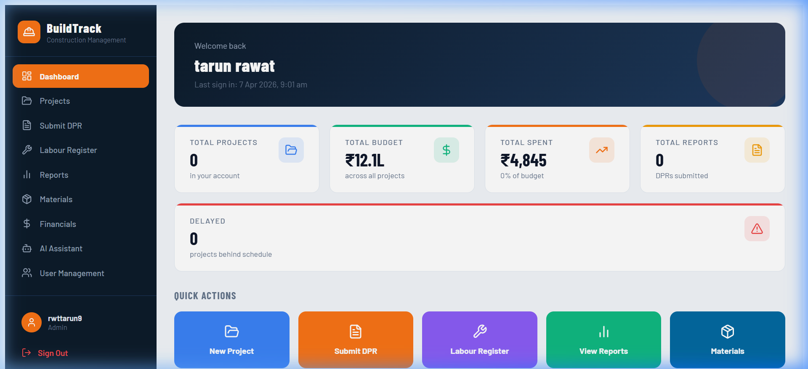
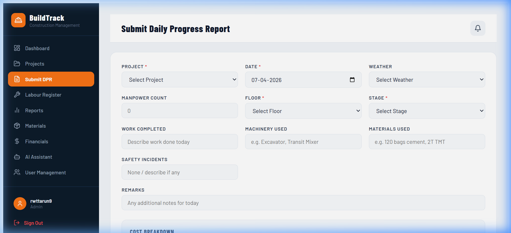
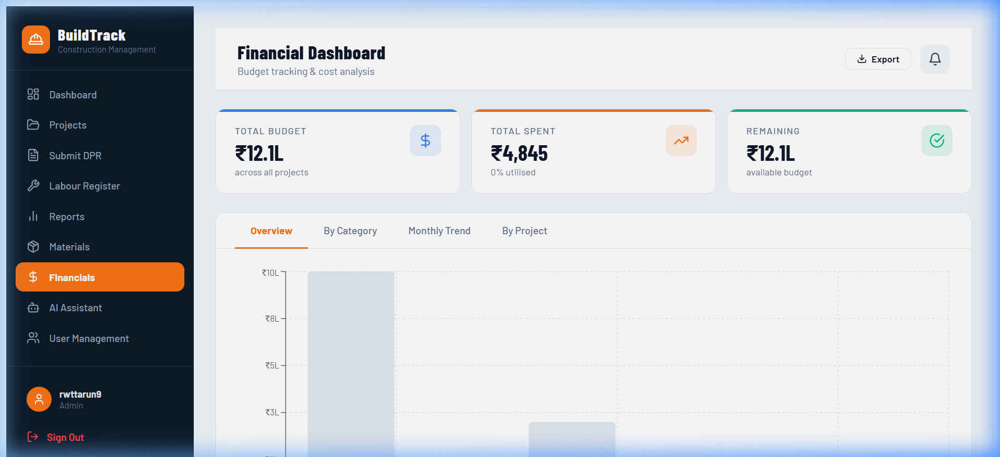

<div align="center">

# 🏗️ BuildTrack

### Construction Progress Management Platform

**Digitise daily site operations — from DPR submission to AI-powered financial analytics.**

[](https://buildtrack-alpha.vercel.app)
[](https://react.dev)
[](https://supabase.com)
[](https://vitejs.dev)
[](https://github.com/tarunrwt/buildtrack/actions/workflows/ci.yml)
[](LICENSE)
[](https://github.com/tarunrwt/buildtrack/commits/main)

</div>

---

## The Problem

Construction site management in India still runs on paper. Daily Progress Reports get handwritten, photographed, and WhatsApp'd to the office — where someone types them into a spreadsheet. Budget overruns get noticed a month late. Materials run out without warning. Labour records are lost in notebooks.

## The Solution

BuildTrack replaces that entire workflow. Engineers submit DPRs from the field in under 60 seconds. Project managers see live dashboards with budget overrun alerts. Materials, labour, and finances are tracked automatically with database-level integrity guarantees.

---

## Key Features

| Module | Capabilities |
|--------|-------------|
| 📊 **Dashboard** | KPI cards with count-up animations · Budget overrun alerts · Quick-action navigation · Delayed project warnings |
| 📁 **Projects** | Create/edit with budget, GPS, site area · Budget utilisation bars · Satellite map with drag-to-pin · PDF export |
| 📝 **Submit DPR** | Weather selector · Cascading floor → stage dropdowns · Full cost breakdown · **Live budget overrun warning** · Site photo upload |
| 🚨 **Site Issues** | Field problem logging with **AI classification** — material delay, equipment failure, weather disruption, safety hazard |
| 👷 **Labour Register** | 4-tab system: Bulk Entry, Manage Workers, Mark Attendance, Attendance Reports · Category-based wage tracking · **Admin-only delete** |
| 📈 **Reports** | 5-tab layout: Cost Trends · Analytics · DPR Table · Photo Gallery · Stage Progress · CSV and PDF export |
| 📦 **Materials** | Inventory with low-stock pulse alerts · Usage/purchase history · Stock auto-updated via database triggers |
| 💰 **Financials** | Budget vs Actual bar charts · Cost category donut · Monthly spend area chart · Per-project breakdown with overrun detection |
| 🤖 **AI Assistant** | Context-aware project Q&A powered by Groq (Llama 3.3) · Responds in English or Hindi · Real-time project data injection |
| 👥 **User Management** | Role-based access (Admin, PM, Engineer, Accountant, Viewer) · Project-level assignments · Invite system |
| 🏠 **Landing Page** | Premium SaaS marketing page with glassmorphism UI, scroll animations, and SEO-optimised meta tags |

---

## Screenshots

<div align="center">

### Dashboard


### Daily Progress Report


### Financial Dashboard


### Labour Register


</div>

---

## Tech Stack

| Layer | Technology | Version | Purpose |
|-------|-----------|---------|---------|
| Frontend | React | 18.3.1 | Component-based UI with hooks |
| Build Tool | Vite | 5.x | Sub-second HMR, optimised production builds |
| Charts | Recharts | 2.12.7 | Declarative React charting |
| Icons | Lucide React | 0.383+ | Tree-shakeable, consistent icon set |
| Backend | Supabase | PostgreSQL 17 | Auth, RLS, Realtime, Storage, Edge Functions |
| AI | Groq (Llama 3.3) | — | Fast inference via Supabase Edge Functions |
| Maps | Leaflet + Esri | — | Satellite imagery with drag-to-pin location |
| Styling | Custom CSS + Tailwind | 3.4.x | App design system + landing page |
| Deployment | Vercel | — | Auto-deploy on push, India region |

---

## Architecture

```
┌─────────────┐     ┌──────────────┐     ┌─────────────────────┐
│   Vercel     │     │   Supabase   │     │   Groq Cloud        │
│   (CDN)      │     │   Platform   │     │   (AI Inference)    │
├─────────────┤     ├──────────────┤     ├─────────────────────┤
│ React SPA    │────▸│ PostgreSQL   │     │ Llama 3.3 70B       │
│ Vite Bundle  │     │ Auth (JWT)   │     │ via Edge Function   │
│              │     │ Storage      │◂────│                     │
│              │     │ Row-Level    │     └─────────────────────┘
│              │     │ Security     │
└─────────────┘     └──────────────┘
```

---

## Database Design

14 tables with full Row-Level Security. Key design decisions:

- **`daily_reports.total_cost` is a `GENERATED ALWAYS` column** — computed by PostgreSQL from five cost fields. The total can never drift between the form, dashboard, and financial reports.
- **All RLS policies use `(SELECT auth.uid())`** — evaluated once per query, not once per row. Critical at scale with thousands of DPR records.
- **Stock levels maintained by triggers** — `material_usage` decrements stock, `material_purchases` increments it. Application state can never corrupt inventory.
- **`projects.total_spent` updated by trigger** — whenever a DPR is inserted/updated, the project's spent total is recalculated automatically.

<details>
<summary><strong>📋 Table Reference</strong></summary>

| Table | Purpose |
|-------|---------|
| `profiles` | User metadata, roles, avatars |
| `projects` | Project definitions with budget, location, status |
| `project_assignments` | User ↔ Project access mapping |
| `daily_reports` | DPR entries with generated total_cost |
| `dpr_photos` | Site photo metadata linked to DPRs |
| `materials` | Material inventory with stock levels |
| `material_purchases` | Purchase records (trigger: increment stock) |
| `material_usage` | Usage records (trigger: decrement stock) |
| `labour_attendance` | Daily labour tracking with wage calculation |
| `workers` | Individual worker registry |
| `site_issues` | AI-classified field issues |
| `notifications` | In-app notification system |
| `user_invites` | Team invitation management |
| `role_change_requests` | Role upgrade request workflow |

</details>

---

## Getting Started

### Prerequisites

- **Node.js** 18+ ([download](https://nodejs.org))
- A **Supabase** project ([create free](https://supabase.com))
- Git

### Installation

```bash
# 1. Clone the repository
git clone https://github.com/tarunrwt/buildtrack.git
cd buildtrack

# 2. Install dependencies
npm install

# 3. Configure environment variables
cp .env.example .env
# Edit .env — add your Supabase URL and anon key (see below)

# 4. Start development server
npm run dev
# → http://localhost:5173
```

### Environment Variables

Create a `.env` file in the project root:

```env
VITE_SUPABASE_URL=https://your-project.supabase.co
VITE_SUPABASE_ANON_KEY=your-anon-key-here
```

| Variable | Where to Find It |
|----------|-----------------|
| `VITE_SUPABASE_URL` | Supabase Dashboard → Project Settings → API → Project URL |
| `VITE_SUPABASE_ANON_KEY` | Supabase Dashboard → Project Settings → API → `anon` `public` key |

> ⚠️ The `.env` file is gitignored. **Never commit API keys.**

### Database Setup

Apply the schema using the Supabase SQL Editor. See [`supabase/README.md`](supabase/README.md) for the full schema reference and migration order.

### Build for Production

```bash
npm run build    # Output in dist/
npm run preview  # Preview production build locally
```

---

## Project Structure

```
buildtrack/
├── .github/
│   ├── workflows/ci.yml              # Lint + build CI on every push
│   ├── ISSUE_TEMPLATE/               # Bug report & feature request templates
│   └── PULL_REQUEST_TEMPLATE.md      # PR checklist
├── public/
│   └── favicon.svg
├── src/
│   ├── App.jsx                        # Root shell — auth, routing, layout (~190 lines)
│   ├── main.jsx                       # React entry point
│   ├── components/                    # 13 shared UI primitives
│   │   ├── index.js                   # Barrel export
│   │   ├── Btn.jsx, Modal.jsx, Input.jsx, Select.jsx
│   │   ├── KPICard.jsx, ProgressBar.jsx, TabBar.jsx
│   │   ├── Badge.jsx, StatusBadge.jsx, Spinner.jsx
│   │   ├── Skeleton.jsx, Empty.jsx, WeatherIcon.jsx
│   ├── constants/                     # Design tokens, nav config, dropdowns
│   │   ├── colors.js                  # FONT, FONT_HEADING, C palette
│   │   ├── navigation.js             # Sidebar nav items
│   │   └── dropdownOptions.js         # Weather, floors, stages
│   ├── features/                      # Feature-based page modules
│   │   ├── ai-assistant/AIAssistant.jsx
│   │   ├── auth/AuthPage.jsx
│   │   ├── dashboard/Dashboard.jsx
│   │   ├── dpr/SubmitDPR.jsx
│   │   ├── financials/Financials.jsx
│   │   ├── issues/SiteIssues.jsx
│   │   ├── labour/LabourRegister.jsx
│   │   ├── materials/Materials.jsx
│   │   ├── projects/
│   │   │   ├── Projects.jsx, ProjectDetail.jsx
│   │   │   └── maps/SatelliteMap.jsx, LocationPicker.jsx
│   │   ├── reports/Reports.jsx, PhotosTab.jsx
│   │   └── users/UserManagement.jsx, ProfileModal.jsx
│   ├── hooks/                         # Custom React hooks
│   │   ├── useCountUp.js, useInView.js, useMediaQuery.js
│   ├── landing/                       # Marketing landing page
│   │   ├── Landing.jsx
│   │   └── landing.css
│   ├── layout/                        # App shell components
│   │   ├── Sidebar.jsx, TopBar.jsx, MobileNav.jsx
│   ├── lib/                           # Core libraries
│   │   ├── supabase.js                # Supabase client init
│   │   ├── financialEngine.ts         # Single source of truth — finances
│   │   └── reportEngine.ts            # Single source of truth — reports
│   ├── styles/global.css              # CSS animations & utilities
│   └── utils/                         # Shared utilities
│       ├── formatters.js, exporters.js, mapLoader.js
├── supabase/README.md                 # Database schema reference
├── docs/screenshots/                  # App screenshots
├── .env.example                       # Environment variable template
├── eslint.config.js                   # ESLint flat config
├── vite.config.js                     # Vite configuration
├── CONTRIBUTING.md                    # Contribution guide
├── SECURITY.md                        # Security policy
├── CHANGELOG.md                       # Version history
└── LICENSE                            # MIT
```

---

## Architecture Decisions

| Decision | Rationale |
|----------|-----------|
| **Feature-based folder structure** | Each feature module is self-contained — easy to find, edit, and lazy-load in the future |
| **No CSS framework in the app** | Full control over the design language — dark navy sidebar, construction-orange accents, Barlow typeface |
| **Generated columns over app-side calculation** | `daily_reports.total_cost` computed by PostgreSQL — self-healing, tamper-proof, zero client-side drift |
| **Centralised financial engine** | `financialEngine.ts` ensures dashboard, reports, and financials show identical numbers |
| **RLS with `(SELECT auth.uid())`** | Evaluated once per query, not once per row — critical for tables with thousands of records |
| **Budget overrun detection** | Live validation in the DPR form + dashboard alerts prevent unnoticed budget overruns |

---

## Roadmap

- [x] Modular feature-based architecture (16 feature modules)
- [x] Budget overrun detection and alerts
- [x] AI-powered issue classification
- [x] Admin-only destructive actions (delete attendance entries)
- [x] Site photo upload with DPR
- [ ] Dynamic imports (`React.lazy`) for code splitting
- [ ] Error boundaries for graceful crash recovery
- [ ] Realtime DPR updates via Supabase Realtime
- [ ] Offline-first DPR submission with service worker
- [ ] React Native mobile app for field engineers
- [ ] Server-side PDF generation with embedded charts
- [ ] Multi-tenant organisation isolation
- [ ] Automated test suite (Vitest + Testing Library)

---

## Contributing

Contributions are welcome! Please read [CONTRIBUTING.md](CONTRIBUTING.md) for guidelines on:
- Branch naming conventions
- Commit message format (Conventional Commits)
- Pull request process

---

## A Note on How This Was Built

I used AI tools (Claude, Gemini) as collaborators throughout this project — for code review, architectural decisions, and debugging. Every line in this repository was read, understood, and deliberately chosen by me. The AI helped me move faster and think through edge cases I would have otherwise missed.

I mention this because hiding AI involvement in portfolio projects is dishonest. The construction domain knowledge, the product decisions, the database design, and the final code are mine. The AI was a tool, not the author.

---

## Author

**Tarun Rawat** — CS Diploma Student · ML & Gen AI Enthusiast · Former NCC Cadet

[](https://github.com/tarunrwt)
[](https://linkedin.com/in/tarunrawat)

---

## License

Distributed under the MIT License. See [`LICENSE`](LICENSE) for details.

---

<div align="center">

*Built for India's construction industry — 2026*

</div>
