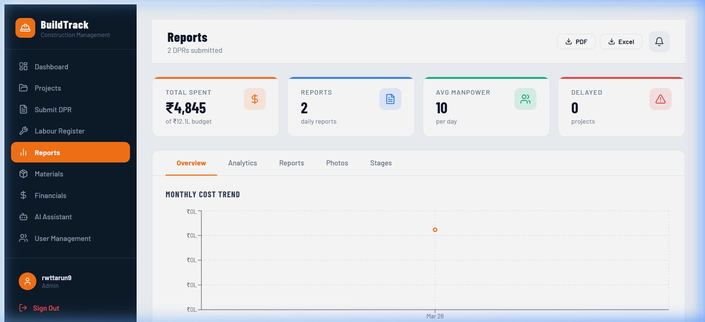

<div align="center">

# 🏗️ BuildTrack

### Construction Progress Management Platform

**Digitise daily site operations — from DPR submission to financial analytics.**

[](https://buildtrack-alpha.vercel.app)
[](https://react.dev)
[](https://supabase.com)
[](https://vitejs.dev)

</div>

---

## The Problem

Construction site management in India still runs on **paper-based Daily Progress Reports (DPRs)**. Site engineers fill out handwritten forms that are:

- Lost or damaged before reaching the office
- Impossible to aggregate across multiple projects
- Disconnected from budgets, materials, and labour data
- Unable to surface cost overruns until it's too late

Project managers and accountants operate blind — making decisions based on stale spreadsheets and phone calls rather than real-time data.

## The Solution

**BuildTrack** is a full-stack web application that replaces the entire paper-based workflow:

> **Field → Submit a DPR in 60 seconds** with weather, manpower, cost breakdown, and site photos.  
> **Office → See real-time dashboards** with budget utilisation, cost trends, and delayed project alerts.

Every data point flows through a single system — from the mason on-site to the CFO reviewing quarterly budgets.

---

## Screenshots

<div align="center">

### Dashboard


### Daily Progress Report


### Reports & Analytics


### Financial Dashboard


</div>

---

## Features

| Module | Capabilities |
|--------|-------------|
| **Dashboard** | KPI cards with count-up animations · Quick-action navigation · Delayed project alerts · Scroll progress indicator |
| **Projects** | Create/edit with budget, GPS, site area · Budget utilisation bars with over-budget danger states · Project-level PDF reports |
| **Submit DPR** | One-tap weather selector · Cascading floor → stage dropdowns · Full cost breakdown (labour, material, equipment, subcontractor, other) · Auto-calculated totals · Site photo upload |
| **Reports** | 5-tab layout: Cost Trends · Analytics · DPR Table · Photo Gallery · Stage Progress · CSV and PDF export |
| **Materials** | Inventory cards with low-stock pulse alerts · Usage/purchase history · Stock auto-updated via database triggers |
| **Financials** | Budget vs. Actual bar charts · Cost category donut · Monthly spend trends · Per-project financial breakdown |
| **Labour Register** | Category-based labour tracking (unskilled → supervisor) · Daily headcount trends |
| **AI Assistant** | Context-aware project Q&A powered by LLM integration |
| **User Management** | Role-based access (Admin, PM, Engineer, Accountant, Viewer) · Project-level assignments · Invite system |

---

## Tech Stack

```
┌─────────────────────────────────────────────────────────┐
│  FRONTEND                                               │
│  React 18 · Vite 5 · Recharts · Lucide Icons            │
│  Custom CSS design system (no framework)                 │
├─────────────────────────────────────────────────────────┤
│  BACKEND                                                │
│  Supabase (PostgreSQL 17)                               │
│  ├── Row Level Security on every table                  │
│  ├── Database triggers (auto-compute totals, stock)     │
│  ├── Generated columns (DPR total_cost)                 │
│  ├── Auth with email/password                           │
│  └── Storage buckets (site photos, 10MB limit)          │
├─────────────────────────────────────────────────────────┤
│  DEPLOYMENT                                             │
│  Vercel (auto-deploy on push) · Region: ap-south-1      │
└─────────────────────────────────────────────────────────┘
```

---

## Database Architecture

12 tables with full Row Level Security. All RLS policies use `(SELECT auth.uid())` for per-query evaluation (not per-row) to avoid performance degradation.

| Table | Purpose |
|-------|---------|
| `projects` | Core project records with budget and GPS |
| `daily_reports` | DPR submissions — `total_cost` is a GENERATED ALWAYS column |
| `dpr_photos` | Photo metadata linked to reports and projects |
| `materials` | Inventory master list with stock levels |
| `material_usage` | Usage log — auto-decrements stock via trigger |
| `material_purchases` | Procurement log — auto-increments stock via trigger |
| `user_roles` | RBAC role definitions (Admin, PM, Engineer, Accountant) |
| `user_project_assignments` | User ↔ Project ↔ Role junction table |
| `notifications` | Per-user notification inbox |
| `project_stage_progress` | Stage completion tracking per project |
| `floors` | Lookup table (replaces free-text) |
| `stages` | Lookup table (replaces free-text) |

---

## Getting Started

### Prerequisites

- Node.js 18+
- A [Supabase](https://supabase.com) project with the schema applied

### Installation

```bash
# Clone the repository
git clone https://github.com/tarunrwt/buildtrack.git
cd buildtrack

# Install dependencies
npm install

# Configure environment
cp .env.example .env
# Edit .env with your Supabase credentials:
#   VITE_SUPABASE_URL=https://your-project.supabase.co
#   VITE_SUPABASE_ANON_KEY=your-anon-key

# Start development server
npm run dev
```

The app starts at `http://localhost:5173`.

### Build for Production

```bash
npm run build    # Output in dist/
npm run preview  # Preview production build locally
```

---

## Project Structure

```
buildtrack/
├── index.html              # Entry point
├── vite.config.js          # Vite configuration
├── package.json
├── .env.example            # Environment template (safe to commit)
├── src/
│   ├── main.jsx            # React root mount
│   ├── App.jsx             # All pages, components, and routing
│   └── lib/
│       ├── supabase.js     # Supabase client initialisation
│       ├── financialEngine.ts  # Single source of truth — all financial calcs
│       └── reportEngine.ts     # Single source of truth — report aggregations
├── supabase/
│   └── README.md           # Schema reference
└── docs/
    └── screenshots/        # App screenshots for documentation
```

---

## Architecture Decisions

| Decision | Rationale |
|----------|-----------|
| **Single-file React app** | MVP-phase simplicity — all 3800+ lines in `App.jsx` with clear section headers. Production refactor would split by feature module. |
| **No CSS framework** | Full control over the industrial design language (dark navy sidebar, construction-orange accents, Barlow typeface). |
| **Generated columns over app-side calc** | `daily_reports.total_cost` is computed by PostgreSQL — self-healing, tamper-proof, zero client-side drift. |
| **Centralised financial engine** | `financialEngine.ts` eliminates dual computation paths. Dashboard, Reports, and Financials all show identical numbers. |
| **RLS with `(SELECT auth.uid())`** | Evaluated once per query, not once per row. Critical for tables with thousands of DPR records. |

---

## Development Methodology

This project was built through **AI-assisted iterative development** — describing features in plain language, reviewing generated code, identifying defects, and directing corrections through structured prompts.

Key skills developed:
- **Prompt engineering** — writing technical specifications as prompts with constraints, edge cases, and output formats
- **System design** — relational schema design with triggers, RLS, generated columns, and lookup tables
- **Debugging** — diagnosing React hooks violations, auth race conditions, and state management bugs
- **Code review** — identifying dual computation paths, over-budget colour logic errors, and loading deadlocks

---

## Roadmap

- [ ] **Error Boundary** — Wrap main content to prevent blank-screen crashes
- [ ] **Realtime subscriptions** — Live updates via Supabase Realtime on DPRs and projects
- [ ] **Offline-first DPR** — Service worker for field submission without connectivity
- [ ] **Mobile app** — React Native wrapper for site engineers
- [ ] **PDF reports** — Server-side PDF generation with charts
- [ ] **Multi-tenant** — Organisation-level isolation for construction firms

---

## Author

**Tarun Rawat**

[](https://github.com/tarunrwt)

---

<div align="center">

*Built with ☕ and structured prompts — 2026*

</div>
